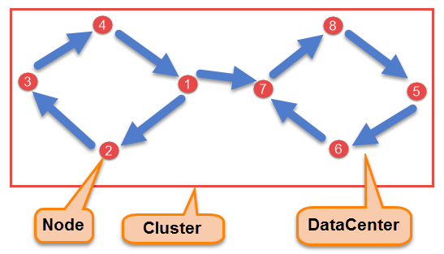
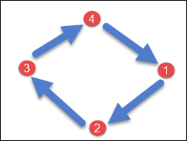
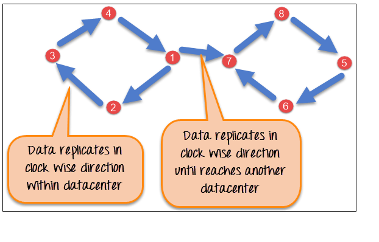

# Understanding the Cassandra Architecture

## Components Of Cassandra

---
### There are following components in Cassandra:

- **Node** - Node is the place where data is stored. It is the basic component of Cassandra.

- **Data Center** - A collection of nodes are called data center. Many nodes are categorized as a data center.

- **Cluster** - The cluster is the collection of many data centers.

- **Commit Log** - Every write operation is written to Commit Log. Commit log is used for crash recovery.

- **Mem-table** - After data written in Commit log, data is written in Mem-table. Data is written in Mem-table temporarily.

- **SSTable** - When Mem-table reaches a certain threshold, data is flushed to an SSTable disk file.

## Data Replication
---
As hardware problem can occur or link can be down at any time during data process, a solution is required to provide a backup when the problem has occurred. So data is replicated for assuring no single point of failure.

Cassandra places *replicas* of data on *different nodes* based on these two factors.

- Where to place next replica is determined by the Replication Strategy.
- While the total number of replicas placed on different nodes is determined by the Replication Factor.

One Replication factor means that there is only a single copy of data while three replication factor means that there are three copies of the data on three different nodes.
For ensuring there is no single point of failure, replication factor must be three.

### There are two kinds of replication strategies in Cassandra.
---
**SimpleStrategy**

SimpleStrategy is used when you have just one data center. SimpleStrategy places the first replica on the node selected by the partitioner. After that, remaining replicas are placed in clockwise direction in the Node ring.

Here is the pictorial representation of the SimpleStrategy.

**NetworkTopologyStrategy**

NetworkTopologyStrategy is used when you have more than two data centers.

In NetworkTopologyStrategy, replicas are set for each data center separately. NetworkTopologyStrategy places replicas in the clockwise direction in the ring until reaches the first node in another rack.

This strategy tries to place replicas on different racks in the same data center. This is due to the reason that sometimes failure or problem can occur in the rack. Then replicas on other nodes can provide data.

Here is the pictorial representation of the Network topology strategy

## Data Writing

Cassandra processes data at several stages on the write path, starting with the immediate logging of a write and ending in with a write of data to disk:
- Logging data in the commit log
- Writing data to the memtable
- Flushing data from the memtable
- Storing data on disk in SSTables

> [More Detailed Documentation](https://docs.datastax.com/en/cassandra/3.0/cassandra/dml/dmlHowDataWritten.html#dmlHowDataWritten__flushing-data-from-the-memtable)

## Data Reading

To satisfy a read, Cassandra must combine results from the active memtable and potentially multiple SSTables.

Cassandra processes data at several stages on the read path to discover where the data is stored, starting with the data in the memtable and finishing with SSTables:
- Check the memtable
- Check row cache, if enabled
- Checks Bloom filter
- Checks partition key cache, if enabled
- Goes directly to the compression offset map if a partition key is found in the partition key cache, or checks the partition summary if not
If the partition summary is checked, then the partition index is accessed

- Locates the data on disk using the compression offset map
- Fetches the data from the SSTable on disk

> [More Detailed Documentation](https://docs.datastax.com/en/cassandra/3.0/cassandra/dml/dmlAboutReads.html)

> ### For learning how Cassandra maintain, update do check the read/write [documentation here](https://docs.datastax.com/en/cassandra/3.0/cassandra/dml/dmlIntro.html) 

## References for understanding Cassandra Strategies and operations 
---
1. [Cassandra Architecture](https://www.guru99.com/cassandra-architecture.html)

1. [Backup And Restore Methods](https://8kmiles.com/blog/cassandra-backup-and-restore-methods/)

2. [Cassandra backups using Nodetool](https://blog.pythian.com/cassandra-backups-using-nodetool/)

3. [Backup Strategies in Cassandra](https://blog.pythian.com/backup-strategies-cassandra/)